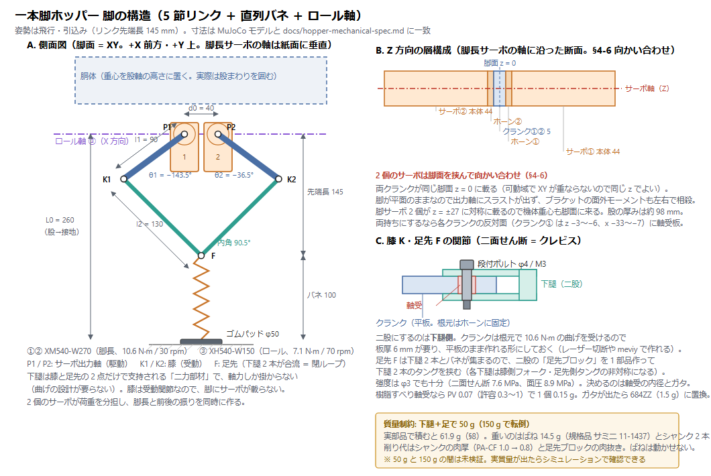
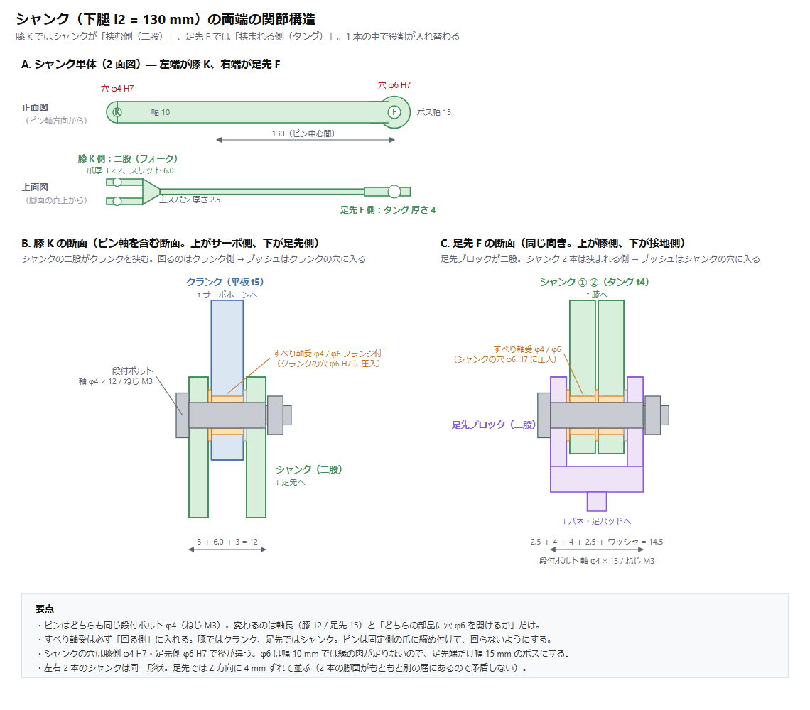
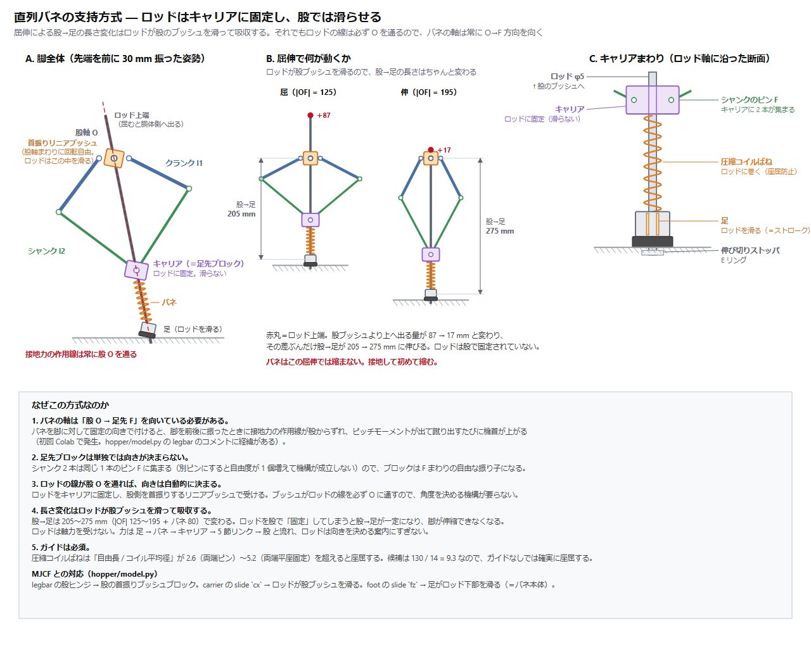

# 一本脚ホッパー 機構設計要件（CAD 用）

作成: 2026-09-09　前提: MuJoCo 3D で成立を確認した構成（`hopper-report.md`、`hopper/model.py` の `HopperParams` 既定値）

この文書は **CAD（Fusion 360）を始めるための入力**。シミュレーションで決まった寸法・荷重・制約をまとめてある。
数値の根拠が要るときは `hopper-report.md`（物理と制御）、`hopper-log.md`（検討の経緯）を見ること。

**CAD の目的は 3 つ**

1. シミュレーションが仮定している寸法・質量配置が**実際に組めるか**（干渉・可動域・バネのストローク）
2. 仮置きの質量・慣性を**実体に置き換える**（§9 の値をシミュレーションへ戻す）
3. 部品調達の前に成立性を確認する（サーボ 3 個で相応の金額になる）

---

## 1. 全体構成

```
胴体（バッテリー・AtomS3R・DC-DC・構造材）
 └ 股軸 ── 重心と同じ高さに置く（§4-1）
    ├ ロール軸 XH540-W150 ── 軸は前後（X）方向、脚面を通す（§4-2）
    │   └ 脚フレーム（ロールで傾く。以下はこのフレーム内）
    │       ├ 脚長サーボ XM540-W270 ①② ── 軸は左右（Y）方向、軸間 d0 = 40 mm
    │       │   └ クランク l1 = 90 mm ×2 → 下腿 l2 = 130 mm ×2 → 足先で合流（5 節リンク）
    │       └ 足先 ── 直列バネ（900 N/m、ストローク 80 mm）── 足（ゴムパッド 半径 25 mm）
    └ ※ ヨー軸はない（旋回はしない。円運動は平行移動で行う）
```



（図は `tools/make_leg_diagram.py` が `hopper/kinematics.py` の運動学から生成する。寸法を変えたら再生成すること）

脚は左右対称の 5 節リンク。**膝は受動関節で、脚にサーボが載らない。** 2 個のサーボが荷重を分担し、
脚長（伸縮）と脚の向き（前後の振り）を同時に作る。左右の振りはロールサーボが脚フレームごと回して作る。

---

## 2. 確定している寸法（シミュレーションの既定値）

| 項目 | 記号 | 値 | 備考 |
| --- | --- | --- | --- |
| サーボ軸間 | `d0` | **40 mm** | 脚長サーボ ①② の出力軸間。本体幅 33.5 mm なので余裕は 6.5 mm |
| クランク長 | `l1` | **90 mm** | 出力軸中心 → 膝ピン中心 |
| 下腿長 | `l2` | **130 mm** | 膝ピン中心 → 足先ピン中心 |
| 基準脚長（股→足、伸展時） | `L0` | **240 mm** | 股軸から足接地点まで |
| 飛行中の引込み | `retract` | **15 mm** | 脚を縮めて着地に備える量 |
| バネ自然長＝最大ストローク | `ls0` | **80 mm** | 足先ピン → 足接地点（無負荷時） |
| リンク先端長 | — | 引込み **145 mm** ／ 伸展 **195 mm** | `L0 − retract − ls0` 〜 ＋蹴り出し 50 mm |
| 足パッド半径 | — | **25 mm 前後**（ゴム） | §4-4 |
| 胴体（慣性用の箱） | — | 300(X) × 160(Y) × 180(Z) mm | 仮置き。CAD で実体に置き換える（§9） |

`l1 = 90 / l2 = 130` は伝達比の掃引で決めた値。`l1` を伸ばすとサーボ負荷は下がるが、
`l1 ≥ 100` は下腿が短くなって外乱耐性が落ちる（`hopper-log.md` §8.8）。**変えないこと。**

---

## 3. サーボ

| 役割 | 型番 | ストール | 無負荷 | 質量 | 本体 | ホーン |
| --- | --- | --- | --- | --- | --- | --- |
| 脚長 ①② | **XM540-W270** ×2 | 10.6 N·m @12 V | 30 rpm | 165 g | 33.5×58.5×44 mm | HN13-N101: Ø26、8-M2.5 P.C.D 22、中央ボス Ø10、中心 M3 |
| ロール ③ | **XH540-W150** ×1 | 7.1 N·m @12 V | 70 rpm | 165 g | 同上 | 同上 |

- ホーン軸〜本体端は **13.75 mm**（ROBOTIS 図面）
- ロールに減速比の小さい XH540 を使うのは**速度が要る**から。XM540（30 rpm）では横 0.2 m/s で速度飽和し、
  姿勢トルクが出せなくなる（`hopper-log.md` §8.9）
- **電流制御モードを使う**（接地中はトルク指令）。両機種とも対応
- 制御周期 **200 Hz 以上**。50 Hz ではその場ホップしかできない。Dynamixel 3 個・4.5 Mbps なら余裕

---

## 4. 制御から来る必須制約

**守らないと転倒する。** いずれもシミュレーションで転倒条件として実測したもの。

### 4-1. 股軸は重心と同じ高さに置く

- 重心より 30 mm 下までは成立、**50 mm 下で転倒**
- 理由: 接地力は股を通るので、股が重心から外れると「ずれ量 × 接地力」がピッチを倒す向きに働く
- 重心より上に置くのは可（受動的に振り子として立ち直る）
- **CAD での意味**: バッテリーと基板の配置で重心高さが決まる。股軸の高さと合わせ込むこと

### 4-2. ロール軸は脚面を通す（横オフセットを作らない）

- 横に **20 mm ずらすと転倒**（着地力がロールサーボの荷重トルクになり、逆駆動される）
- **CAD での意味**: ロールサーボ本体（幅 33.5 mm）が脚面と重なる。**本体を前後（X）にずらして逃がす**必要がある。
  脚は前後に振れるので、振り角の限界との取り合いになる（§6）

### 4-3. 下腿＋足は 50 g 以下

- **150 g で転倒**（飛行中の脚振りの反作用で胴体のピッチが毎ホップ数度ずつ蓄積する）
- 対象: 下腿 2 本 ＋ 足先ピン ＋ バネの可動側 ＋ 足パッド
- **CAD での意味**: 下腿はカーボンロッドか薄肉の 3D プリント。金属の使用は膝ピン・足先ピンに限る

### 4-4. 足はゴムパッド（点接地にしない）

- 点接地だと横移動でヨーが**毎ホップ 18.7°** ドリフトする。捩り摩擦 20 mm 相当（μ 0.8 × 半径 25 mm）で **3.8°/hop** に減る
- **CAD での意味**: 半径 25 mm 程度の平らなゴム底。球面にすると捩り摩擦が落ちる

### 4-5. 直列バネのストロークは 80 mm 以上

- 通常の圧縮ピークは **52 mm**。ストロークが足りず底付きすると、着地エネルギーを回収できず跳べなくなる
- **CAD での意味**: 足先ピンから足接地点まで 80 mm のストロークを直線的に確保する（§7）

---

## 5. 荷重条件

立位（先端長 145 mm、内角 90.5°）での計算値。

| 条件 | 接地力 | クランクトルク（1 個） | 下腿 1 本の軸力 |
| --- | --- | --- | --- |
| 通常のホップ（3D 実測） | **47 N**（3.1×mg） | 2.97 N·m | 33 N |
| 2D の見積もり | 65 N | 4.11 N·m | 46 N |
| **設計荷重** | **150 N**（≈10×mg） | **9.48 N·m** | **107 N** |

- **設計荷重 150 N の根拠**: サーボのストール 10.6 N·m が発生できる足先力は約 168 N。
  つまり**機構が受ける力の上限はサーボが決める**ので、ストール相当を設計点にすれば構造は破綻しない
- ただし**落下や踏み外しではバネが底付きした後に衝撃が構造へ直接入る**。
  機械ストッパを設けるか、テストの落下高さを制限すること
- 蹴り出し中（伸展 195 mm、内角 55.9°）は伝達比が 126 → 83 mm/rad に落ち、同じトルクでも足先力は 1.5 倍になる。
  この姿勢での下腿の座屈を確認すること
- ロールサーボには接地中 **4 N·m 程度**（ストールの 56 %）が掛かる

---

### 5-1. 関節ピンと軸受



（図は `tools/make_shank_diagram.py` が生成する。寸法を変えたら再生成すること）

膝 K・足先 F とも **段付ボルト 軸径 φ4 h7 / ねじ M3**（SUS304 または SCM435）。軸長だけが違う。

| 関節 | 二股（挟む側） | 挟まれる側 | 段付ボルト | 積層 |
| --- | --- | --- | --- | --- |
| 膝 K | シャンク（爪 t3 × 2） | クランク（平板 t5） | 軸 φ4 × **12** | 3 ＋ 6.0 ＋ 3 = 12.0 |
| 足先 F | 足先ブロック（爪 t2.5 × 2） | シャンク 2 本（タング t4） | 軸 φ4 × **15** | 2.5 ＋ 4 ＋ 4 ＋ 2.5 ＋ ワッシャ = 14.5 |

軸受は**すべり軸受（無給油ブッシュ）内径 φ4 / 外径 φ6 / フランジ φ8 × 0.5**。必ず「回る側」の部品に圧入する
（膝ではクランク、足先ではシャンク）。ピンは固定側の爪に締め付けて回らないようにする。

**φ4 を選んだ根拠**（設計荷重＝ストール相当の軸力 118 N、爪の中心間スパン 9.0〜9.4 mm）:

| 軸径 | 二面せん断 | 曲げ | 安全率（SUS304 降伏 205 MPa） | 質量 |
| --- | --- | --- | --- | --- |
| φ3 | 8.3 MPa | 104 MPa | 2.0 | 0.86 g |
| **φ4** | 4.7 MPa | **44 MPa** | **4.7** | 1.53 g |
| φ5 | 3.0 MPa | 23 MPa | 9.1 | 2.39 g |

**サイズを決めているのは曲げであって、せん断でも面圧でもない。** すべり軸受の PV 値は 0.07 MPa·m/s
（許容 0.3〜1）で十分低い。したがって**クランクの板厚を 5 mm から厚くする設計変更をしたらピン径を見直すこと**
（スパンが 10 mm を超えるなら φ5）。

普通のボルトをピンに使ってはいけない。ねじ山を軸受面にすると数千サイクルでかじってガタになる。

### 5-2. シャンクの断面

主スパンは**座屈**で決まる（軸力 118 N、長さ 130 mm、両端ピン支持を保守側とする）。

| 案 | 断面 | 座屈安全率 | 質量（1 本） |
| --- | --- | --- | --- |
| **A2017 削り出し** | 幅 10 × 厚 2.5 mm | 4.7 | 約 9 g |
| **PA-CF プリント** | 外形 10 × 10 mm 中空、肉厚 1.0 mm | 5.8 | 約 5.6 g |
| カーボンパイプ φ6 × φ4 | — | 25 | 3.3 g ＋ 継手 3.5 g |

- 軸応力は 4.7 MPa しかない。**板厚は強度ではなく座屈で決まっている**
- 穴径は膝側 **φ4 H7**、足先側 **φ6 H7**（ブッシュが入る側）。足先端だけ**幅 15 mm のボス**にする
- 樹脂の場合は中実にしない。中実だと板厚 7〜8 mm 必要になり、アルミより重くなる
- 樹脂の場合は (1) ピン穴に金属ブッシュを圧入（クリープ対策）、(2) 必ず寝かせてプリント（層間剥離が弱方向）、
  (3) 二股の付け根に R3 以上（応力集中）
- 左右 2 本のシャンクは同一形状。足先では Z 方向に 4 mm ずれて並ぶ

---

## 6. 可動域と干渉チェック

クランク角は「+X から +Z へ反時計回り」で測る（`hopper/kinematics.py` と同じ定義）。

| 姿勢 | 先端 (x, z) mm | クランク① | クランク② | 伝達比 | 内角 |
| --- | --- | --- | --- | --- | --- |
| 飛行・引込み（中立） | (0, −145) | −143.5° | −36.5° | 126 mm/rad | 90.5° |
| 飛行・前に 40 mm | (40, −139) | −125.3° | −17.6° | 127 | 89.9° |
| 飛行・後ろに 40 mm | (−40, −139) | −162.4° | −54.7° | 127 | 89.9° |
| 蹴り出し最大（+50 mm） | (0, −195) | −117.0° | −63.0° | 83 | 55.9° |
| 蹴り出し＋前 30 mm | (30, −193) | −106.1° | −52.0° | 84 | 55.7° |

- **クランク①: −162°〜−106°（振れ 56°）、クランク②: −63°〜−18°（振れ 45°）**。
  XM540 の可動域には余裕で収まる。CAD ではこの範囲で干渉がないことを確認する
- **内角（下腿どうしのなす角）は 55°以上**を保つこと。0° に近づくと特異点で足先を支えられない
- ロール軸の可動域は **±40°** を見込む（モデルでは ±45.8°）

**確認すべき干渉**

1. クランク① ↔ サーボ②本体、クランク② ↔ サーボ①本体（軸間 40 mm、本体幅 33.5 mm）
2. 下腿どうし（内角 55° の伸展姿勢）
3. ロールサーボ本体 ↔ 脚フレーム・クランク（§4-2 の前後逃がし）
4. 脚を後ろへ振ったとき（クランク① −162°）の胴体下面との干渉
5. バネ機構 ↔ 下腿（ストローク全域で）

---

## 7. 直列バネ

### 7-1. 諸元

| 項目 | 値 |
| --- | --- |
| ばね定数 | **900 N/m**（機体 1.55 kg 前提） |
| ストローク | **80 mm 以上** |
| 静的沈み | 16.9 mm |
| 固有振動 | 3.84 Hz（接地時間 165〜190 ms に対応） |
| 圧縮 52 mm（通常ピーク）時 | 47 N、蓄積エネルギー 1.22 J |
| 圧縮 80 mm（底付き）時 | 72 N |
| 減衰比 | 0.2（ゴムやグリスで得られる程度。専用ダンパは不要） |

**質量が変わったらばね定数を比例させる**（静的沈み 16.9 mm を保つ）。例: 2.0 kg なら 1160 N/m。
入手可能な定数に合わせて機体質量の方を決め直してよい。

### 7-2. 支持方式：ロッドはキャリアに固定し、股では滑らせる（確定）



（図は `tools/make_spring_diagram.py` が `hopper/kinematics.py` の運動学から生成する）

```
        ║  ← ロッド上端（屈むと胴体側へ最大 87 mm 出る）
    ╔═══╗
O ──╢ ● ╟── 首振りリニアブッシュ（股軸まわりに回転自由。ロッドはこの中を滑る）
    ╚═══╝
        ║  ガイドロッド φ5（キャリアに固定）
        ●  F キャリア＝足先ブロック（ロッドに固定。滑らない）
       ≋║≋  圧縮コイルばね（ロッドに巻く）
        ▬  足（ロッドを滑る＝バネのストローク）＋ゴムパッド
        ▭  伸び切りストッパ（E リング）
```

**シャンクにバネを直付けしてはいけない。** 理由は 2 つ。

1. **バネの軸は「股 O → 足先 F」を向いている必要がある。**
   バネを脚に対して固定の向きで付けると、脚を前後に振ったときに接地力の作用線が股からずれ、
   ピッチモーメントが出て蹴り出すたびに機首が上がる。これは初回の Colab で実際に発生した
   （`hopper/model.py` の `legbar` のコメントに経緯がある）
2. **足先ブロックは単独では向きが決まらない。**
   シャンク 2 本は同じ 1 本のピン F に集まる（別ピンにすると自由度が 1 個増えて機構が成立しない）ので、
   ブロックは F まわりの自由な振り子になる

**ロッドは股で「固定」してはいけない。** 固定すると股→足が一定になり、脚が伸縮できなくなる。
股側は首振りするリニアブッシュで受ける。これで

- ブッシュがロッドの線を必ず O に通す → 角度が自動的に決まる（角度を決める機構が要らない）
- ロッドがブッシュを滑る → 股→足の長さ変化 **205〜275 mm**（|OF| 125〜195 ＋ バネ 80）を吸収する

**ロッドは軸力を受けない。** 力は 足 → バネ → キャリア → 5 節リンク → 股 と流れる。
ロッドは向きを決める案内にすぎず、受けるのは横力と曲げだけ。

Raibert の元祖ホッパー（伸縮脚＋股関節）と同じ構成で、5 節リンクは
「脚軸に沿ってキャリアを押し引きするアクチュエータ」として働く。

**MJCF との対応**（`hopper/model.py`）

| MJCF | 実機 |
| --- | --- |
| `legbar` の股ヒンジ | 股の首振りブッシュブロック |
| `carrier` の slide `cx` | ロッドが股ブッシュを滑る |
| `foot` の slide `fz`（バネ） | 足がロッド下部を滑る |

参考: 2 本のシャンクの二等分線は O→F 方向と最大 2.1°（常用域 1° 以内）しかずれないが、
二等分線を機械的に作るには差動歯車が要るのでロッド方式の方が単純。

### 7-3. 部品

| 部品 | 仕様 | 備考 |
| --- | --- | --- |
| ガイドロッド | φ5、全長 **約 312 mm**（キャリアより上 212 ＋ 下 100） | キャリアに固定。軸力は受けない |
| 股の首振りブッシュブロック | リニアブッシュ（内径 φ5、長さ 25）＋股軸まわりの軸受 | P1・P2 の間（40 mm の隙間）に置く |
| キャリア（＝足先ブロック） | ロッドに固定。シャンク 2 本のピン穴 F | 下面が上側ばね座（§5-1） |
| 圧縮コイルばね | ロッドに巻く | 下記 7-4 |
| 足 | ロッドを滑るブッシュ＋ゴムパッド | 下側ばね座を兼ねる。§4-4 |
| 伸び切りストッパ | ロッド下端の E リング | 飛行中に足が落ちないように |

**CAD で確認すること**: 屈んだとき（|OF| = 125）ロッド上端が股ブッシュより **87 mm** 上に出る。
胴体の中にこの分の逃げと、ロッドが振れる角度ぶんの扇形のクリアランスが要る。

### 7-4. バネ選定で必ず押さえること

- **ガイドは必須。** 圧縮コイルばねは「自由長 / コイル平均径」が 2.6（両端ピン）〜5.2（両端平座固定）を
  超えると座屈する。候補は 130 / 14 = 9.3 なので、ガイドなしでは確実に座屈する
- **座巻きは研削（クローズドエンド研削）。** 座面が平らでないとバネが首を振り、
  リニアブッシュを横荷重で噛ませる。摺動抵抗の最大要因になる
- **ばね内径はロッド径 ＋ 1.0〜1.5 mm。** 擦るとヒステリシスが出て跳躍高さが不安定になる
- **底付きストッパを別に設ける。** 密着させると衝撃が構造に直入りする

### 7-5. 未解決：自由長と質量

具体的に選定すると、バネが質量収支の最大の壁になる。

| 線径 × 平均径 × 巻数 | k | 密着長 | 必要自由長 | 最大荷重 | ねじり応力 | 質量 |
| --- | --- | --- | --- | --- | --- | --- |
| φ1.6 × 14 × 26 巻（ストローク 80） | 901 N/m | 44.8 | **130 mm** | 72 N | 732 MPa | **19.4 g** |
| 同（ストローク 52 に制限） | 901 N/m | 44.8 | 102 mm | 47 N | 476 MPa | 19.4 g |

- 自由長 **130 mm** が必要で、モデルの `ls0 = 80 mm` という前提と合わない。ロッドもその分長くなる
- 質量 **19.4 g** で、§8 の仮置き（足全体で 50 g）を強く圧迫する
- **ばねを硬くしても軽くならない。** コイルばねの材料体積は蓄積エネルギーと許容応力だけで決まる
  （V = 4GU/τ²）ので、k を変えても同じ。軽くする唯一の方法は必要ストロークそのものを減らすこと
- したがって **ばね定数 × 足質量の掃引でストローク要求を確定させないと、ロッド長もバネも決まらない**。
  現在ここが CAD の律速（§10）

---

## 8. 質量収支

| 項目 | 質量 |
| --- | --- |
| サーボ 3 個（165 g × 3） | 495 g |
| 胴体でサーボ以外に使える分 | **1,005 g**（バッテリー・AtomS3R 6.7 g・DC-DC・半二重基板・構造材） |
| 足（下腿 2 本＋足先＋バネ可動側＋パッド） | **50 g 以下**（§4-3） |
| 合計（現行の想定） | 1.55 kg |

- **超えてもよい。ただしばね定数を比例させ、シミュレーションを回し直すこと**（§9）
- 電源は 2 系統: サーボ 12 V、AtomS3R 5 V

---

## 9. CAD からシミュレーションへ返してほしい数値

CAD が固まったら、以下を `hopper/model.py` の `HopperParams` に入れて再検証する。
これで「仮置きの質量・慣性」という現在の最大の不確かさが消える。

| 返す値 | 現在の仮置き | 入れる先 |
| --- | --- | --- |
| 胴体の質量 | 1.5 kg | `mb` |
| 胴体の慣性テンソル | 300×160×180 の箱として計算（ピッチ 0.0153、ロール 0.0073 kg·m²） | `bl` / `bw` / `bh`（または慣性を直接指定できるよう拡張する） |
| 重心 → 股軸の距離 | 0 mm | `hb` |
| 下腿＋足の質量 | 50 g | `mf` |
| クランク・下腿の質量と慣性 | 各 5 g（ほぼゼロ） | MJCF の `inertial`（`model.py` を要修正） |
| 干渉で制限されたクランク角 | 制限なし | MJCF の `joint range` |
| 実際のばね定数・ストローク | 900 N/m、80 mm | `ks` / `ls0` |
| 足パッドの半径と材質 | 捩り摩擦 20 mm 相当 | `foot_pad` / `mu` |

**あわせて実測してほしいもの**（サーボが手に入ったら）

- **XM540 / XH540 の反射慣性**。現在 0.02 / 0.0063 kg·m² は減速比² × ロータ慣性の概算で、
  足先換算 8 kg 相当と支配的なパラメータ。無負荷で電流ステップを与え、角加速度から求められる

---

## 10. 未決事項

1. **ロールサーボの逃がし方**（§4-2）。前後にずらすと脚の振り角と干渉する。CAD の主要な検討点
2. **バネのストローク要求**（§7-5）。ばね定数 × 足質量の掃引で確定させる。
   これが決まらないとロッド長もバネの自由長も質量も決まらない。CAD の律速
   （支持方式そのものは §7-2 で確定：ガイドロッドを股軸で支える）
3. **胴体の形**。慣性用の箱 300×160×180 mm は仮。前後に長いほうがピッチ慣性が増えて安定するが、
   重い胴体はサーボ負荷に直結する
4. **バッテリー**。12 V 系。容量と質量は未定
5. **足パッドの材質**。μ 0.8 を想定。実際のゴムで確認が要る
6. **組立と保守**。ホーンの締結（8-M2.5 P.C.D 22）、ケーブルの取り回し（脚が振れる・ロールする）

---

## 11. Fusion 360 アドイン `tools/fusion/HopperLeg/`

この要件書のとおりに骨格を生成するアドインを用意した（四脚用の `QuadLegLinkage/` はそのまま残してある）。
ソリッドタブ → 作成 → **Hopper Leg** でダイアログが開く。

**座標系**: 股軸の中点 O が原点、**+X 前方、+Y 上、脚面は XY 平面、+Z は板厚（左右）方向**。
MuJoCo 側は Z 上なので、CAD の +Y が MuJoCo の +Z に対応する。
脚長サーボ ①② の出力軸は Z 方向、ロールサーボ ③ の出力軸は X 方向で脚面（Z = 脚の層の中心）を貫通する。

**生成するもの**

| 部品 | 内容 |
| --- | --- |
| クランク ①② | 長さ `l1`、ホーン穴パターン（8-M2.5 P.C.D 22 ＋ 中心 Ø10.2）つき |
| 下腿 ①② | 長さ `l2`、両端にピン穴。足先で合流（閉ループ） |
| 直列バネ＋足パッド | 股 O → 足先 F の延長線上（§4-5）。圧縮量をパラメータで動かせる |
| 脚長サーボ ①② | XM540-W270 の外形（33.5×58.5×44）＋ホーン |
| ロールサーボ ③ | XH540-W150。軸は X 方向、本体は後方へ `rollOff` 逃がす（§4-2） |
| ロール軸 | X 方向の細い棒として可視化（脚面の中心を通る） |
| 胴体エンベロープ | 慣性の箱。**重心が股軸高さ（Y=0）と脚面に来る**位置に置く（§4-1） |

ジョイント（`J_c1` / `J_c2` / `J_k1` / `J_k2` / `J_tip` / `J_spring`）を as-built で作るので、
**`J_c1` / `J_c2` をドラッグすれば 5 節リンクが動き、可動域と干渉を確認できる。**
ダイアログの状態欄にはクランク角・内角・伝達比・足先位置に加え、特異点（内角 20° 未満）と
サーボ本体どうしの干渉を警告として出す。

運動学は `hopper/kinematics.py`（MuJoCo モデル）と**同一の式で、数値が一致することを確認済み**。
ダイアログの値を変えれば、シミュレーションと同じ姿勢を CAD 上に再現できる。

**生成しないもの**: サーボ同士をつなぐブラケット類。
ロールサーボの軸を脚面に通しつつ本体を前後へ逃がす設計（§4-2）と、
脚長サーボ ①② を保持する脚フレームは CAD の主要な検討課題そのものなので、
アドインは「動かせない要素の正しい位置と軸」だけを置き、ブラケットは設計者が描く。
