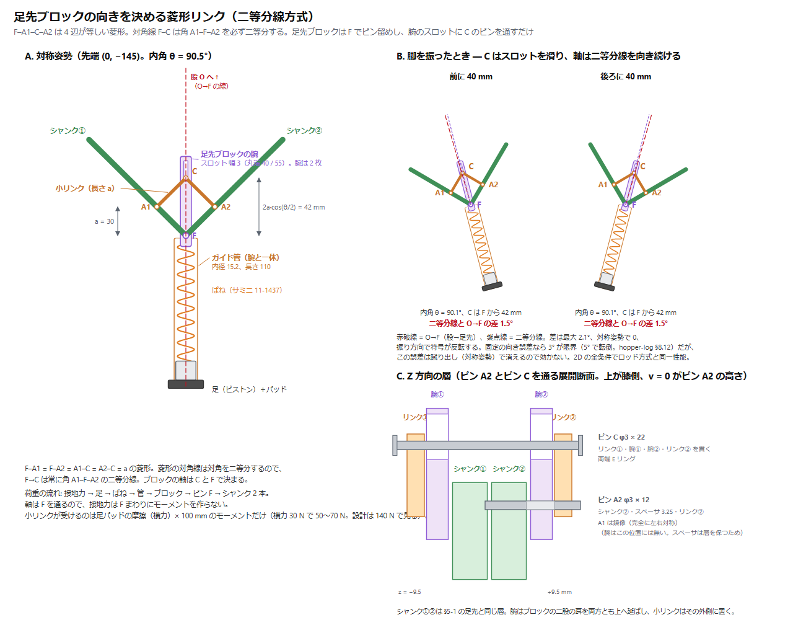

# 一本脚ホッパー 機構設計要件（CAD 用）

作成: 2026-09-09　前提: MuJoCo 3D で成立を確認した構成（`hopper-report.md`、`hopper/model.py` の `HopperParams` 既定値）

この文書は **CAD（Fusion 360）を始めるための入力**。シミュレーションで決まった寸法・荷重・制約をまとめてある。
数値の根拠が要るときは `hopper-report.md`（物理と制御）、`hopper-log.md`（検討の経緯）を見ること。

**CAD の目的は 3 つ**

1. シミュレーションが仮定している寸法・質量配置が**実際に組めるか**（干渉・可動域・バネのストローク）
2. 仮置きの質量・慣性を**実体に置き換える**（§9 の値をシミュレーションへ戻す）
3. 部品調達の前に成立性を確認する（サーボ 3 個で相応の金額になる）

---

## 1. 全体構成

```
胴体（バッテリー・AtomS3R・DC-DC・構造材）
 └ 股軸 ── 重心と同じ高さに置く（§4-1）
    ├ ロール軸 XH540-W150 ── 軸は前後（X）方向、脚面を通す（§4-2）
    │   └ 脚フレーム（ロールで傾く。以下はこのフレーム内）
    │       ├ 脚長サーボ XM540-W270 ①② ── 軸は左右（Y）方向、軸間 d0 = 40 mm
    │       │   └ クランク l1 = 90 mm ×2 → 下腿 l2 = 130 mm ×2 → 足先で合流（5 節リンク）
    │       └ 足先ブロック（向きは菱形リンクで 2 本の下腿の二等分線に固定、§7-2）
    │           └ ガイド管 ── 直列バネ（1560 N/m、自由長 100 mm）── 足（ゴムパッド 半径 25 mm）
    └ ※ ヨー軸はない（旋回はしない。円運動は平行移動で行う）
```


（図は `tools/make_leg_diagram.py` が `hopper/kinematics.py` の運動学から生成する。寸法を変えたら再生成すること）

脚は左右対称の 5 節リンク。**膝は受動関節で、脚にサーボが載らない。** 2 個のサーボが荷重を分担し、
脚長（伸縮）と脚の向き（前後の振り）を同時に作る。左右の振りはロールサーボが脚フレームごと回して作る。

---

## 2. 確定している寸法

> `L0` と `ls0` は 2026-09-13 に更新した（規格品のばね サミニ 11-1437 を採用、§7）。
> **リンク先端長 145 / 195 mm は変わっていない**ので、§5・§6 の荷重・可動域はそのまま使える。
> **シミュレーターの既定値はまだ旧値のまま**（3D 確認待ち。§7-5）。

| 項目 | 記号 | 値 | 備考 |
| --- | --- | --- | --- |
| サーボ軸間 | `d0` | **40 mm** | 脚長サーボ ①② の出力軸間。本体幅 33.5 mm なので余裕は 6.5 mm |
| クランク長 | `l1` | **90 mm** | 出力軸中心 → 膝ピン中心 |
| 下腿長 | `l2` | **130 mm** | 膝ピン中心 → 足先ピン中心 |
| 基準脚長（股→足、伸展時） | `L0` | **260 mm** | 股軸から足接地点まで。バネ自由長 100 mm にあわせて 240 → 260（§7-1） |
| 飛行中の引込み | `retract` | **15 mm** | 脚を縮めて着地に備える量 |
| バネ自由長 | `ls0` | **100 mm** | 足先ピン → 足接地点（無負荷時）。ストッパは 58 mm（§7-4） |
| リンク先端長 | — | 引込み **145 mm** ／ 伸展 **195 mm** | `L0 − retract − ls0` 〜 ＋蹴り出し 50 mm |
| 足パッド半径 | — | **25 mm 前後**（ゴム） | §4-4 |
| 胴体（慣性用の箱） | — | 300(X) × 160(Y) × 180(Z) mm | 仮置き。CAD で実体に置き換える（§9） |

`l1 = 90 / l2 = 130` は伝達比の掃引で決めた値。`l1` を伸ばすとサーボ負荷は下がるが、
`l1 ≥ 100` は下腿が短くなって外乱耐性が落ちる（`hopper-log.md` §8.8）。**変えないこと。**

---

## 3. サーボ

| 役割 | 型番 | ストール | 無負荷 | 質量 | 本体 | ホーン |
| --- | --- | --- | --- | --- | --- | --- |
| 脚長 ①② | **XM540-W270** ×2 | 10.6 N·m @12 V | 30 rpm | 165 g | 33.5×58.5×44 mm | HN13-N101: Ø26、8-M2.5 P.C.D 22、中央ボス Ø10、中心 M3 |
| ロール ③ | **XH540-W150** ×1 | 7.1 N·m @12 V | 70 rpm | 165 g | 同上 | 同上 |

- ホーン軸〜本体端は **13.75 mm**（ROBOTIS 図面）
- ロールに減速比の小さい XH540 を使うのは**速度が要る**から。XM540（30 rpm）では横 0.2 m/s で速度飽和し、
  姿勢トルクが出せなくなる（`hopper-log.md` §8.9）
- **電流制御モードを使う**（接地中はトルク指令）。両機種とも対応
- 制御周期 **200 Hz 以上**。50 Hz ではその場ホップしかできない。Dynamixel 3 個・4.5 Mbps なら余裕

---

## 4. 制御から来る必須制約

**守らないと転倒する。** いずれもシミュレーションで転倒条件として実測したもの。

### 4-1. 股軸は重心と同じ高さに置く

- 重心より 30 mm 下までは成立、**50 mm 下で転倒**
- 理由: 接地力は股を通るので、股が重心から外れると「ずれ量 × 接地力」がピッチを倒す向きに働く
- 重心より上に置くのは可（受動的に振り子として立ち直る）
- **CAD での意味**: バッテリーと基板の配置で重心高さが決まる。股軸の高さと合わせ込むこと

### 4-2. ロール軸は脚面を通す（横オフセットを作らない）

- 横に **20 mm ずらすと転倒**（着地力がロールサーボの荷重トルクになり、逆駆動される）
- **CAD での意味**: ロールサーボ本体（幅 33.5 mm）が脚面と重なる。**本体を前後（X）にずらして逃がす**必要がある。
  脚は前後に振れるので、振り角の限界との取り合いになる（§6）

### 4-3. 下腿＋足は 50 g 以下

- **150 g で転倒**（飛行中の脚振りの反作用で胴体のピッチが毎ホップ数度ずつ蓄積する）
- 対象: 下腿 2 本 ＋ 足先ピン ＋ バネの可動側 ＋ 足パッド
- **CAD での意味**: 下腿はカーボンロッドか薄肉の 3D プリント。金属の使用は膝ピン・足先ピンに限る

### 4-4. 足はゴムパッド（点接地にしない）

- 点接地だと横移動でヨーが**毎ホップ 18.7°** ドリフトする。捩り摩擦 20 mm 相当（μ 0.8 × 半径 25 mm）で **3.8°/hop** に減る
- **CAD での意味**: 半径 25 mm 程度の平らなゴム底。球面にすると捩り摩擦が落ちる

### 4-5. 直列バネのストロークは 80 mm 以上

- 通常の圧縮ピークは **52 mm**。ストロークが足りず底付きすると、着地エネルギーを回収できず跳べなくなる
- **CAD での意味**: 足先ピンから足接地点まで 80 mm のストロークを直線的に確保する（§7）

---

## 5. 荷重条件

立位（先端長 145 mm、内角 90.5°）での計算値。

| 条件 | 接地力 | クランクトルク（1 個） | 下腿 1 本の軸力 |
| --- | --- | --- | --- |
| 通常のホップ（3D 実測） | **47 N**（3.1×mg） | 2.97 N·m | 33 N |
| 2D の見積もり | 65 N | 4.11 N·m | 46 N |
| **設計荷重** | **150 N**（≈10×mg） | **9.48 N·m** | **107 N** |

- **設計荷重 150 N の根拠**: サーボのストール 10.6 N·m が発生できる足先力は約 168 N。
  つまり**機構が受ける力の上限はサーボが決める**ので、ストール相当を設計点にすれば構造は破綻しない
- ただし**落下や踏み外しではバネが底付きした後に衝撃が構造へ直接入る**。
  機械ストッパを設けるか、テストの落下高さを制限すること
- 蹴り出し中（伸展 195 mm、内角 55.9°）は伝達比が 126 → 83 mm/rad に落ち、同じトルクでも足先力は 1.5 倍になる。
  この姿勢での下腿の座屈を確認すること
- ロールサーボには接地中 **4 N·m 程度**（ストールの 56 %）が掛かる

---

### 5-1. 関節ピンと軸受


（図は `tools/make_shank_diagram.py` が生成する。寸法を変えたら再生成すること）

膝 K・足先 F とも **段付ボルト 軸径 φ4 h7 / ねじ M3**（SUS304 または SCM435）。軸長だけが違う。

| 関節 | 二股（挟む側） | 挟まれる側 | 段付ボルト | 積層 |
| --- | --- | --- | --- | --- |
| 膝 K | シャンク（爪 t3 × 2） | クランク（平板 t5） | 軸 φ4 × **12** | 3 ＋ 6.0 ＋ 3 = 12.0 |
| 足先 F | 足先ブロック（爪 t2.5 × 2） | シャンク 2 本（タング t4） | 軸 φ4 × **15** | 2.5 ＋ 4 ＋ 4 ＋ 2.5 ＋ ワッシャ = 14.5 |

軸受は**すべり軸受（無給油ブッシュ）内径 φ4 / 外径 φ6 / フランジ φ8 × 0.5**。必ず「回る側」の部品に圧入する
（膝ではクランク、足先ではシャンク）。ピンは固定側の爪に締め付けて回らないようにする。

**φ4 を選んだ根拠**（設計荷重＝ストール相当の軸力 118 N、爪の中心間スパン 9.0〜9.4 mm）:

| 軸径 | 二面せん断 | 曲げ | 安全率（SUS304 降伏 205 MPa） | 質量 |
| --- | --- | --- | --- | --- |
| φ3 | 8.3 MPa | 104 MPa | 2.0 | 0.86 g |
| **φ4** | 4.7 MPa | **44 MPa** | **4.7** | 1.53 g |
| φ5 | 3.0 MPa | 23 MPa | 9.1 | 2.39 g |

**サイズを決めているのは曲げであって、せん断でも面圧でもない。** すべり軸受の PV 値は 0.07 MPa·m/s
（許容 0.3〜1）で十分低い。したがって**クランクの板厚を 5 mm から厚くする設計変更をしたらピン径を見直すこと**
（スパンが 10 mm を超えるなら φ5）。

普通のボルトをピンに使ってはいけない。ねじ山を軸受面にすると数千サイクルでかじってガタになる。

### 5-2. シャンクの断面

主スパンは**座屈**で決まる（軸力 118 N、長さ 130 mm、両端ピン支持を保守側とする）。

| 案 | 断面 | 座屈安全率 | 質量（1 本） |
| --- | --- | --- | --- |
| **A2017 削り出し** | 幅 10 × 厚 2.5 mm | 4.7 | 約 9 g |
| **PA-CF プリント** | 外形 10 × 10 mm 中空、肉厚 1.0 mm | 5.8 | 約 5.6 g |
| カーボンパイプ φ6 × φ4 | — | 25 | 3.3 g ＋ 継手 3.5 g |

- 軸応力は 4.7 MPa しかない。**板厚は強度ではなく座屈で決まっている**
- 穴径は膝側 **φ4 H7**、足先側 **φ6 H7**（ブッシュが入る側）。足先端だけ**幅 15 mm のボス**にする
- 樹脂の場合は中実にしない。中実だと板厚 7〜8 mm 必要になり、アルミより重くなる
- 樹脂の場合は (1) ピン穴に金属ブッシュを圧入（クリープ対策）、(2) 必ず寝かせてプリント（層間剥離が弱方向）、
  (3) 二股の付け根に R3 以上（応力集中）
- 左右 2 本のシャンクは同一形状。足先では Z 方向に 4 mm ずれて並ぶ
- **足先 F から 30 mm の位置に φ3 の穴を 1 つ追加**する（菱形リンクのピン A1 / A2。§7-2）。
  幅 10 mm の主スパン上でよい（縁肉 3.5 mm）

---

## 6. 可動域と干渉チェック

クランク角は「+X から +Z へ反時計回り」で測る（`hopper/kinematics.py` と同じ定義）。

| 姿勢 | 先端 (x, z) mm | クランク① | クランク② | 伝達比 | 内角 |
| --- | --- | --- | --- | --- | --- |
| 飛行・引込み（中立） | (0, −145) | −143.5° | −36.5° | 126 mm/rad | 90.5° |
| 飛行・前に 40 mm | (40, −139) | −125.3° | −17.6° | 127 | 89.9° |
| 飛行・後ろに 40 mm | (−40, −139) | −162.4° | −54.7° | 127 | 89.9° |
| 蹴り出し最大（+50 mm） | (0, −195) | −117.0° | −63.0° | 83 | 55.9° |
| 蹴り出し＋前 30 mm | (30, −193) | −106.1° | −52.0° | 84 | 55.7° |

> **2026-09-13 注記**: ばねを規格品（自由長 100 mm）にしたが、`L0` を 240 → 260 mm にすることで
> **リンク先端長 145 mm を据え置いた**ので、この表は変更なしでそのまま有効（§7-1）。
> 参考までに、L0 = 240 のまま先端長を詰める案では 125 mm になり、後ろ振りで
> **クランク① が −174.8°**（水平まで 5.2°）まで回る。**先端長 114 mm 以下は不可**
> （クランク① が +178° まで回り、水平を越えて相手側サーボ本体と干渉する）。

- **クランク①: −162°〜−106°（振れ 56°）、クランク②: −63°〜−18°（振れ 45°）**。
  XM540 の可動域には余裕で収まる。CAD ではこの範囲で干渉がないことを確認する
- **内角（下腿どうしのなす角）は 55°以上**を保つこと。0° に近づくと特異点で足先を支えられない
- ロール軸の可動域は **±40°** を見込む（モデルでは ±45.8°）

**確認すべき干渉**

1. クランク① ↔ サーボ②本体、クランク② ↔ サーボ①本体（軸間 40 mm、本体幅 33.5 mm）
2. 下腿どうし（内角 55° の伸展姿勢）
3. ロールサーボ本体 ↔ 脚フレーム・クランク（§4-2 の前後逃がし）
4. 脚を後ろへ振ったとき（クランク① −162°）の胴体下面との干渉
5. バネ機構 ↔ 下腿（ストローク全域で）

---

## 7. 直列バネ

### 7-1. 諸元（2026-09-13 更新：規格品 サミニ 11-1437 を採用）

| 項目 | 値 | 旧値 |
| --- | --- | --- |
| ばね | **サミニ 11-1437**（ミスミ扱い、規格品） | — |
| ばね定数 | **1.56 N/mm（1560 N/m）** | 900 N/m |
| 自由長 | **100 mm** | 80（＝ストローク兼用） |
| 全タワミ（密着まで） | 63 mm | — |
| 底付きストッパ位置 | **58 mm** | 80 |
| 基準脚長 `L0` | **260 mm** | 240 |
| リンク先端長 `Ln` | **145 mm（変更なし）** | 145 |
| 静的沈み | 9.4 mm | 16.9 |
| 固有振動 | 5.1 Hz | 3.84 |
| 接地時間 | 126 ms | 167 |
| 通常ホップ（5 cm）の圧縮 | 42.7 mm、67 N | 64.4 mm、58 N |
| 落下 10 cm の圧縮 | 47.5 mm、74 N | 71.4 mm |
| 減衰比 | 0.2（ゴムやグリスで得られる程度。専用ダンパは不要） | 同 |

**なぜ硬くしたか**: 実在の圧縮コイルばねは「自由長 ＝ 密着長 ＋ 全タワミ」なので、
900 N/m で 80 mm のストロークを取ると自由長が 117 mm 以上になり、脚に収まらない。
ばねを硬くすると縮み量そのものが減る（§7-5）。

**なぜ L0 を 260 にしたか**: 自由長が 80 → 100 mm になった分、脚が 20 mm 伸びる。
`Ln = 145 mm` を据え置くことで、**§6 の可動域・干渉チェックの表がそのまま使える**
（クランク角も伝達比も変わらない）。L0 = 240 のまま Ln を 125 mm に詰めることもできて
2D では成立するが、後ろ振りでクランク① が −174.8°（水平まで 5.2°）まで回るので勧めない。

**質量が変わったらばね定数を比例させる**（静的沈み 9.4 mm を保つ）。例: 2.0 kg なら 2010 N/m。

### 7-2. 支持方式：足先ブロックの向きを菱形リンクで二等分線に固定する（2026-09-13 確定）



（図は `tools/make_bisector_diagram.py` が `hopper/kinematics.py` の運動学から生成する）

```
             K1                                K2
               \                              /
                \  シャンク①        シャンク② /
                 \           C            /       ← 合流ピン C（常に二等分線上）
                  \        / ▒ \         /
                   \      /  ▒  \       /          ← 小リンク × 2（長さ a = 30）
                    A1    /   ▒   \    A2         ← シャンク上、F から a のピン
                      \  /    ▒    \  /
                       \/     ▒     \/
                        \     ▒     /
                         \    ▒    /
                          \   ▒   /
                            \ ▒ /
                              F                    ← ピン F（シャンク 2 本 ＋ 足先ブロック）
                             ═╪═
                             ≋│≋   ← 足先ブロックと一体のガイド管 ＋ ばね
                             ═╧═   ← 足（ピストン）＋パッド
   ▒ = 足先ブロックの腕に切ったスロット。C のピンがこの中を滑る
```

**原理**: F–A1 = F–A2 = A1–C = A2–C = a の**菱形**。菱形の対角線は対角を二等分するので、
F→C は常に角 A1–F–A2（2 本の下腿のなす角）の二等分線を向く。足先ブロックは F でピン留めし、
腕のスロットに C のピンを通すだけで、ブロックの軸＝ガイド管の軸が二等分線に固定される。
内角が変わると C は二等分線上を F から **40〜53 mm**（内角 97°〜56°）の範囲で動く。スロットはその逃げ。

**なぜ向きを決める必要があるか**（2 つの事実）

1. **バネの軸は「股 O → 足先 F」を向いている必要がある。**
   脚に対して固定の向きで付けると、脚を前後に振ったときに接地力の作用線が股からずれ、
   ピッチモーメントが出て蹴り出すたびに機首が上がる（初回の Colab で実際に発生。
   `hopper/model.py` の `legbar` のコメントに経緯がある）
2. **足先ブロックは単独では向きが決まらない。**
   シャンク 2 本は同じ 1 本のピン F に集まる（別ピンにすると自由度が 1 個増えて機構が成立しない）ので、
   ブロックは F まわりの自由な振り子になる

**向きの精度要求は 3°**（`hopper-log.md` §8.12）。固定のずれが 3° でピッチ 15°、5° で転倒する。
したがって「片方の下腿に固定」「柔らかい心出しばね」「単一のタイリンクで近似」は使えず、
**運動学的に**決めなければならない。二等分線は O→F と最大 2.1° ずれるが、
**対称姿勢で 0・振り方向で符号が反転**する誤差なので蹴り出しでは消え、
2D の全条件でロッド方式（旧 7-2）と同一性能だった。

**荷重の流れ**: 接地力 → 足 → ばね → ガイド管 → 足先ブロック → ピン F → シャンク 2 本。
軸は F を通るので接地力は F まわりにモーメントを作らない。小リンクが受けるのは
足パッドの摩擦（横力）× 100 mm のモーメントを 21 mm の腕で受けるぶんだけ（横力 30 N で約 140 N）。

**MJCF との対応**（`hopper/model.py`）— モデルは変更しない

| MJCF | 実機 |
| --- | --- |
| `legbar` の股ヒンジ（バネ軸 = O→F） | 菱形リンク（バネ軸 = 二等分線。差 ≤ 2.1°） |
| `carrier` の slide `cx` | 対応する部品なし（ロッドが無いので） |
| `foot` の slide `fz`（バネ） | 足がガイド管の中を滑る |

2D では `sprAx=1`（二等分線モード）で同一性能を確認済み（`tools/hopper_spring_axis.js`）。

**旧方式（参考。2026-09-13 に置き換え）**: ロッドをキャリアに固定し、股で首振りリニアブッシュに
滑らせる方式（`img/hopper-spring.png`、`tools/make_spring_diagram.py`）。機能は同等だが、
長さ 212 mm のロッド（11.6 g）と股のブッシュブロック（約 10 g）が要り、
屈んだときにロッドが胴体内へ最大 73 mm 突き出すため胴体側に逃げが必要だった。
菱形リンクはこれらを消して足先に約 4.5 g を足す。

### 7-3. 部品

| 部品 | 仕様 | 備考 |
| --- | --- | --- |
| 足先ブロック | F の二股（§5-1）＋**腕**（幅 8 × 厚 2.5、F から上へ 58 mm、**スロット 3 × 18** を F から 38〜56 mm に）＋ガイド管、を 1 部品 | 腕は片方の耳（z +4.75〜7.25）をそのまま上へ延ばす |
| **小リンク × 2** | 長さ a = **30 mm**（ピン間）、A2017 t2、φ3 穴 × 2 | 各シャンクの外面側の層に置く。**約 0.5 g × 2** |
| ピン A1・A2 | φ3 × 14 段付ボルト。シャンクの F から 30 mm の穴（§5-2） | A2 側は腕の層を飛び越えるスペーサ 3.25 |
| ピン C | φ3 × 22、両端 E リング | リンク①・腕（スロット）・リンク② を貫く |
| **ガイド管** | PA-CF、**内径 15.2 / 肉厚 1.0 / 長さ 110 mm**、足先ブロックと一体 | ばねの外に被せる。**6.7 g** |
| 圧縮コイルばね | ガイド管の中に入れる。サミニ 11-1437 | §7-4 |
| 足 | ガイド管の中を滑るピストン＋ゴムパッド | 下側ばね座を兼ねる。管が長い案内になるのでこじりに強い。§4-4 |
| 伸び切りストッパ | ガイド管下端の内向きつば | 飛行中に足が落ちないように |
| 底付きストッパ | 縮み **58 mm** で当てる | 密着（63 mm）させない |

**Z 方向の層**（ピン C の位置。§5-1 の足先と同じ層を使う）

| z [mm] | 部品 |
| --- | --- |
| −6.5 〜 −4.5 | リンク① |
| −4.25 〜 −0.25 | シャンク① |
| +0.25 〜 +4.25 | シャンク② |
| +4.75 〜 +7.25 | 足先ブロックの腕（スロット） |
| +7.5 〜 +9.5 | リンク② |

**ガイドを外側にする理由**: ばね内径が 10.8 mm なので、内側ガイドにすると φ9.5 の太い軸が要る
（ガイド径 ＝ ばね内径 − 1.0〜1.5 mm）。外側なら管 1 本で「ばねの座屈防止」と「足のこじり防止」を兼ねられる。

**CAD で確認すること**

1. 内角 56°（蹴り出し最大）で C が F から 53 mm。スロット上端 56 mm に対する余裕 3 mm
2. 小リンクと腕・シャンクの干渉（層で分けてあるが、ピン頭・E リングの出っ張りを含めて）
3. 腕（幅 8）と 2 本のシャンクの XY クリアランス。F 付近で最も狭い

### 7-4. ばねの仕様（規格品）

**サミニ「圧縮スプリング（SWP-A／SUS304-WPB）」 型番 11-1437**（ミスミで購入可）

| 項目 | 値 |
| --- | --- |
| 材質 | ピアノ線 **SWP-A** |
| 端面 | **研削あり**（＝閉じ・両端研削。座面が平らでないとばねが首を振るので必須） |
| 線径 | **φ1.6** |
| 外径 | **φ14**（内径 10.8） |
| 自由長 | **100 mm** |
| ばね定数 | **1.56 N/mm** |
| 全タワミ | **63 mm**（密着長 37 mm） |
| 最大荷重 | 98.1 N |
| RoHS2 | 対応 |

**逆算した値**（カタログにない項目）

| 項目 | 値 |
| --- | --- |
| コイル平均径 | 12.4 mm |
| 有効巻数 / 総巻数 | 21.6 / 23.6 |
| ばね指数 C | 7.75（4〜12 の適正域） |
| 質量 | **14.5 g** |
| サージング周波数 | 171 Hz（運転 5.1 Hz の 34 倍。共振しない） |

**荷重とねじり応力**（許容 950 MPa ＝ SWP-A φ1.6 の引張強さ 2110 MPa × 0.45）

| 状態 | 縮み | 荷重 | 応力 | 許容比 |
| --- | --- | --- | --- | --- |
| 静止立位 | 9.4 mm | 14.7 N | 135 MPa | 14 % |
| 通常ホップ（5 cm） | 44.2 mm | 69.0 N | 633 MPa | 67 % |
| 落下 10 cm | 48.8 mm | 76.1 N | 699 MPa | 74 % |
| **底付きストッパ（58 mm）** | 58 mm | 90.5 N | 831 MPa | 87 % |
| 落下 15 cm | 57.3 mm | 89.4 N | 820 MPa | 86 % |
| 全タワミ（密着） | 63 mm | 98.3 N | 902 MPa | 95 % |

**設計上の決めごと**

- **底付きストッパは 58 mm に置く**（全タワミ 63 mm の手前）。密着させると衝撃が構造に直入りする。
  落下 15 cm（δ 57.3 mm）まではストッパに当たらない
- **ガイドは外側（チューブ）。** 内径 10.8 mm に内側ガイドを入れると φ9.5 の太いロッドになり重い。
  外側なら管 1 本で「ばねの座屈防止」と「足のこじり防止」を兼ねられる（§7-3）。
  自由長 / コイル平均径 = 100 / 12.4 = 8.1 なので**ガイドなしでは確実に座屈する**
- ガイド管の内径は **15.2 mm 以上**（外径 14 ＋ 逃げ 1.2）

**代替**: 同一性能の特注も可能（サミニは 1 本から受ける）。ただし規格品で要求を満たすので不要。

**3D モデル**: メーカーの CAD データが無いので、カタログ値から生成するスクリプトを用意した
（`tools/fusion/Spring/Spring.py`）。Fusion の ユーティリティ → アドイン → スクリプト から実行する。
**`DEFLECTION` に縮み量を入れればその状態の形が出る**ので、§7-3 の確認項目
「バネ機構 ↔ 下腿（ストローク全域で）」はこれで見る。

| `DEFLECTION` | 高さ | ピッチ | コイル隙間 | 荷重 | 用途 |
| --- | --- | --- | --- | --- | --- |
| 0 | 100.0 mm | 4.551 | 2.951 mm | 0 N | 組付け前・部品図 |
| 9.4 | 90.6 mm | 4.116 | 2.516 mm | 14.7 N | 静止立位 |
| 44.2 | 55.8 mm | 2.507 | 0.907 mm | 69.0 N | 通常ホップ 5 cm |
| 47.5 | 52.5 mm | 2.354 | 0.754 mm | 74.1 N | 落下 10 cm（常用の最大） |
| 58.0 | 42.0 mm | 1.869 | 0.269 mm | 90.5 N | 底付きストッパ位置 |

死巻（上下 1 巻）はピッチ 0 の平らな巻きにしてあるので端面が座面になる。
質量は 14.6 g（カタログから逆算した 14.5 g と一致）。材質は Steel を当てているので
`physicalProperties` がそのまま §9 に使える。

手で作るなら Fusion の **コイル**（作成 → コイル）で近似できる:
径 **12.4**（断面位置 = 中心）／断面 = 円形／断面サイズ **1.6**／回転数 **23.62**／高さ **98.4**。
ただし等ピッチなので死巻（平らな端）は再現されない。

### 7-5. 根拠（2D 掃引 `tools/hopper_stroke_sweep.js`）

**ストロークは削れない。** ks 900 のまま必要な縮み量を測ると、その場ホップ 5 cm で 64.4 mm、
9 cm で 73.5 mm、落下 10 cm で 71.4 mm、落下 15 cm で 80.2 mm。60 mm のストッパでは足りない。

**ばね定数を上げるのが正解。** mb 1.5 kg 固定で k を振ると:

| k [N/m] | 静沈 | δ hdes5 | hdes9 | 落下10 | 落下15 | 前進 0.2 の τ | Ts | 頂点追従 |
| --- | --- | --- | --- | --- | --- | --- | --- | --- |
| 900 | 16.4 | 64.4 | 73.5 | 71.4 | 80.2 | 69 % | 167 ms | OK |
| 1200 | 12.3 | 51.2 | 58.1 | 57.2 | 66.4 | 77 % | 141 ms | OK |
| **1500** | **9.8** | **43.8** | **48.2** | **48.8** | **57.3** | **81 %** | **125 ms** | **OK** |
| 1800 | 8.2 | 37.4 | 40.3 | 43.1 | 50.8 | 84 % | 117 ms | hdes9 で 8.2 cm |
| 2400 | 6.1 | 29.8 | 30.3 | 35.3 | 41.8 | 98 % | 103 ms | hdes9 で 6.5 cm |

**1500 が上限。** 1800 以上では蹴り出しが足りず、目標ホップ高 9 cm に届かなくなる。

採用案（ks 1500 / 自由長 91 / L0 240 / cn 0.6）と現行の条件別比較では、
**頂点は 3〜9 cm すべて追従、前進 0.1/0.2/0.3 → 0.07/0.14/0.21 m/s（現行と同等）、
接地力ピークも同等（78〜116 N）、ω は 98 → 96 % とむしろ改善**。
唯一の代償は**クランクトルクで、前進 0.2 m/s で 71 → 82 %** に上がる。

> **未確認**: 上表はすべてピッチ面の 2D。**3D（MuJoCo）での再確認がまだ**。
> 2D は 3D より 2 割ほど悲観的に出る（ks 900 のとき 2D τ 61 % に対し 3D は 48 %）ので
> 3D では 65 % 程度に収まる見込みだが、接地写像 (a, b) が変わるため `cn` / `kv` の
> 再同定が要る（`hopper/run.py` の `sweep_gains()`）。
> シミュレーターの既定値（`hopper/model.py` の `ks` / `ls0`、`controller.py` の `cn`、
> `tools/webapp/hopper-2d.html` の `DEF`）は **3D 確認まで変更していない**。

**規格品（サミニ 11-1437）での判定** — `node tools/spring_check.js --k 1.56 --lf 100 --od 14 --dmax 63 --l0 260`

| 条件 | δ | 頂点 | v | τ | ω |
| --- | --- | --- | --- | --- | --- |
| その場 3 / 5 / 7 / 9 cm | 40.6 / 42.7 / 45.1 / 46.2 mm | 3.0 / 5.0 / 7.0 / **9.2** cm | — | 64〜70 % | 96 % |
| 前進 0.1 / 0.2 / 0.3 m/s | 42.6 mm | 5.0 cm | 0.07 / 0.13 / 0.20 | 77 / 81 / **88** % | 96 % |
| 落下 6 / 10 / 15 cm | 42.8 / 47.5 / 55.8 mm | 5.0 cm | — | 66〜76 % | 92 % |

全 7 項目 ○ で **採用可**。使用可能たわみ 63 mm に対し常用の必要量は 47.5 mm（75 %）。

---

### 7-6. 調達（2026-09-13 決着：規格品で足りる）

**結論: サミニ 11-1437（ミスミ扱い）で要求を満たす。特注は不要。**

探索の過程で分かったのは「棚を間違えていた」ということ。以下は経緯の記録。

ネックは**たわみ率**（使用ストローク ÷ 自由長）。本設計は 55 / 91 = **60 %** で、
市販の標準圧縮ばねの許容を超える。ミスミの丸線コイルスプリングの許容最大たわみは
**WY 75 % / WF 45 % / WL・WT 40 % / WM 28〜35 % / WH 20〜30 %**。
60 % を許すのは WY だけだが、WY は金型用（プレス用）の系列でばね定数が桁違いに高く、
1.5 N/mm は出せない。

**標準品に寄せる案はいずれも代償が大きい**（L0 = 240 mm を保つ前提）

| 案 | 自由長 | Ln | 判定 |
| --- | --- | --- | --- |
| ks 1500・たわみ率 45 % の標準品 | 122 mm | 103 mm | **不可**。クランクが水平を越えてサーボ本体と干渉 |
| ks 1800・同上 | 111 mm | 114 mm | **不可**。同上（後ろ振りでクランク① が +178°） |
| ks 2400・同上 | 89 mm | 136 mm | 幾何は成立するが**不可**。前進 0.2 m/s でクランクトルク 98 %（§7-5） |
| **ks 1500・特注（たわみ率 60 %）** | **91 mm** | **134 mm** | **採用** |
| ks 1500・たわみ率 45 % の標準品 ＋ 脚を伸ばす | 122 mm | 145 mm | 可。ただし **L0 = 282 mm** になり 3D の再検証が要る |

**ミスミ WL（金型用標準部品）の実地確認（2026-09-13）**: 選べるばね定数は
**0.5 / 1.0 / 2.9 N/mm の 3 つだけ**だった。金型用の系列はばね定数が粗く飛ぶ。
この 3 つが使えるかを 2D で判定した結果、**どれも不可**。

| k [N/m] | hdes 9 の到達 | 前進 0.2 の τ | 必要ストローク | たわみ率 40 % での自由長 | 判定 |
| --- | --- | --- | --- | --- | --- |
| 500 | **転倒** | 82 % | 125 mm | 313 mm | 不可 |
| 1000 | 9.0 cm | 73 % | 75 mm | **188 mm** | 自由長が脚に収まらない |
| 2900 | **5.6 cm** | **97 %** | 35 mm | 88 mm | トルク飽和。ホップ高が出ない |

**金型用（WY / WF / WL / WT / WM / WH）は棚が違う。** 高荷重・短ストローク用なので、
本用途（軽荷重・長ストローク）とは逆。探すなら**汎用の圧縮ばね**（内径基準／外径基準の
ステンレス・ピアノ線タイプ）の棚で、ばね定数の刻みが細かい系列を見ること。

**ばねを直列／並列に重ねても解決しない。** 直列にすると k は下がりストロークは増えるが、
必要自由長 ＝ ストローク ÷ たわみ率 の比は変わらない。並列（入れ子）も同じ。
たわみ率は「ばね 1 本の設計ピッチ」で決まる量なので、組み合わせでは変えられない。

**代案（規格品で行くなら）: 脚を伸ばす。** たわみ率 45 % の規格品（k 1.5 N/mm・自由長 122 mm）
を使い、**L0 = 282 mm**（Ln = 145 は現行と同じ）にする。2D では全条件で成立した
（頂点 3〜9 cm 追従、前進 0.1/0.2/0.3 → 0.08/0.15/0.22 m/s、τ 65〜87 %、ω 96 %）。
δ は L0 240 の案と同一（43.7〜57.3 mm）。ただし

- **重心が 42 mm 高くなる。** ロール面の安定余裕が減るので、ロール 2D と 3D で確認が要る
- §6 の可動域表・Fusion アドイン・胴体設計がすべて L0 = 240 前提なので、波及が大きい

**特注の出し方**: §7-4 の表をそのまま渡せる。1 個から受けるメーカーが複数ある
（東海バネ工業、葵スプリング など）。単価は数千円、小ロットなら 1 本あたりはもっと下がる。

**準標準の可能性（未確認）**: ミスミに「外径・自由長フリー指定タイプ」があり、
外径 Φ9 / 11 / 13 / **15** / 17 / 25 / 27、自由長は 1 mm 単位で指定できる。
Φ15 は本設計の外径 14.95 とほぼ一致する。**この系列にばね定数 1.5 N/mm 付近の
荷重クラスがあるかは要確認**（カタログの数値を取れていない）。

**候補が見つかったら `tools/spring_check.js` で判定する**

```
node tools/spring_check.js --k 1.5 --lf 91 --od 15 --dmax 55
node tools/spring_check.js --k 1.5 --lf 122 --od 15 --ratio 0.45   # たわみ率で指定してもよい
```

ばね定数・自由長・外径・使用可能たわみ（または たわみ率）を渡すと、2D で全条件を回して
「外径がガイド管に入るか／先端長が干渉しないか／常用で底付きしないか／ホップ高 9 cm に届くか／
サーボのトルクと速度が持つか／転倒しないか」を ○× で出す。

**候補の系列**: ミスミが扱う **サミニ「圧縮スプリング（SWP-A／SUS304-WPB）」**が近い。
外径 1.7〜100 mm、自由長 5〜350 mm、材質はピアノ線（SWP-A）とステンレス（SUS304-WPB）。
同じ外径で線径を選べるので、ばね定数の刻みが金型用より細かい。**サミニは 1 本から特注も受ける。**

**探すときの条件**（許容幅つき）

| 項目 | 狙い | 許容 |
| --- | --- | --- |
| ばね定数 | 1.50 N/mm | 1.35〜1.65（±10 %。外れたら §7-5 の掃引をやり直す） |
| 外径 | 14.95 mm | **16.0 mm 以下**（ガイド管の内径 16.1 に入ること） |
| 自由長 | 91 mm | 85〜95 mm |
| 使用可能ストローク | 55 mm | **50 mm 以上**（＝たわみ率 55 % 以上） |
| 密着長 | 32 mm | 36 mm 以下 |
| 材質 | SWP-B（ピアノ線） | SUS304-WPB でも可。ただし線径が太くなり質量 +5 g |

規格品を数値で絞り込めるサイト: アキュレイト（ウルトラスプリング、967 種。
外径・線径・自由高さ・ばね定数・許容荷重で検索できる）、モノタロウ（920 種常時在庫）。

---

## 8. 質量収支

| 項目 | 質量 |
| --- | --- |
| サーボ 3 個（165 g × 3） | 495 g |
| 胴体でサーボ以外に使える分 | **1,005 g**（バッテリー・AtomS3R 6.7 g・DC-DC・半二重基板・構造材） |
| 足（下腿 2 本＋足先＋バネ可動側＋パッド） | **50 g 以下**（§4-3） |
| 合計（現行の想定） | 1.55 kg |

**足まわりの内訳**（§7 のばね仕様を入れた見積り）

| 部品 | 質量 |
| --- | --- |
| シャンク 2 本（PA-CF 中空 ＋ 金具） | 15.0 g |
| キャリア（足先ブロック） | 5.0 g |
| ばね サミニ 11-1437（φ1.6 × 外径 14 × 自由長 100） | **14.5 g** |
| ガイド管（PA-CF 内径 15.2 × 肉厚 1.0 × 110） | 6.7 g |
| 足（ピストン＋ばね座） | 4.0 g |
| ゴムパッド | 3.0 g |
| ピン・軸受類 | 5.0 g |
| 菱形リンク（小リンク 2 本＋ピン A1・A2・C） | 2.5 g |
| 足先ブロックの腕（スロット付き） | 2.0 g |
| **合計** | **57.7 g** |

50 g を 7.7 g 超える。削るならシャンク（PA-CF 中空の肉厚 1.0 → 0.8）か足先ブロックの肉抜き。
ばねは規格品なので動かせない。なお旧方式のロッド（11.6 g）と股ブッシュブロック（約 10 g）は
この表の外（脚の質量）だったので、機体全体では約 17 g 軽くなっている。

- **超えてもよい。ただしばね定数を比例させ、シミュレーションを回し直すこと**（§9）
- 電源は 2 系統: サーボ 12 V、AtomS3R 5 V

---

## 9. CAD からシミュレーションへ返してほしい数値

CAD が固まったら、以下を `hopper/model.py` の `HopperParams` に入れて再検証する。
これで「仮置きの質量・慣性」という現在の最大の不確かさが消える。

| 返す値 | 現在の仮置き | 入れる先 |
| --- | --- | --- |
| 胴体の質量 | 1.5 kg | `mb` |
| 胴体の慣性テンソル | 300×160×180 の箱として計算（ピッチ 0.0153、ロール 0.0073 kg·m²） | `bl` / `bw` / `bh`（または慣性を直接指定できるよう拡張する） |
| 重心 → 股軸の距離 | 0 mm | `hb` |
| 下腿＋足の質量 | 50 g | `mf` |
| クランク・下腿の質量と慣性 | 各 5 g（ほぼゼロ） | MJCF の `inertial`（`model.py` を要修正） |
| 干渉で制限されたクランク角 | 制限なし | MJCF の `joint range` |
| 実際のばね定数・ストローク | 900 N/m、80 mm | `ks` / `ls0` |
| 足パッドの半径と材質 | 捩り摩擦 20 mm 相当 | `foot_pad` / `mu` |

**あわせて実測してほしいもの**（サーボが手に入ったら）

- **XM540 / XH540 の反射慣性**。現在 0.02 / 0.0063 kg·m² は減速比² × ロータ慣性の概算で、
  足先換算 8 kg 相当と支配的なパラメータ。無負荷で電流ステップを与え、角加速度から求められる

---

## 10. 未決事項

1. **ロールサーボの逃がし方**（§4-2）。前後にずらすと脚の振り角と干渉する。CAD の主要な検討点
2. **ばね定数 1560 N/m（サミニ 11-1437）と L0 = 260 mm の 3D 確認**（§7-5）。2D では成立を確認済み。
   MuJoCo で接地写像 (a, b) を測り直し、`cn` / `kv` を再同定する（`hopper/run.py` の `sweep_gains()`）。
   前進 0.2 m/s のクランクトルクが 2D で 71 → 82 % に上がっているので、3D でも確認する。
   これが通ればシミュレーターの既定値を更新し、CAD の寸法が確定する
   （ストローク要求と支持方式そのものは §7-2 / §7-5 で確定。二等分線方式は 2D で確認済み、
   MJCF は O→F のままでよい：差 ≤ 2.1°）
3. **胴体の形**。慣性用の箱 300×160×180 mm は仮。前後に長いほうがピッチ慣性が増えて安定するが、
   重い胴体はサーボ負荷に直結する
4. **バッテリー**。12 V 系。容量と質量は未定
5. **足パッドの材質**。μ 0.8 を想定。実際のゴムで確認が要る
6. **組立と保守**。ホーンの締結（8-M2.5 P.C.D 22）、ケーブルの取り回し（脚が振れる・ロールする）

---

## 11. Fusion 360 アドイン `tools/fusion/HopperLeg/`

この要件書のとおりに骨格を生成するアドインを用意した（四脚用の `QuadLegLinkage/` はそのまま残してある）。
ソリッドタブ → 作成 → **Hopper Leg** でダイアログが開く。

**座標系**: 股軸の中点 O が原点、**+X 前方、+Y 上、脚面は XY 平面、+Z は板厚（左右）方向**。
MuJoCo 側は Z 上なので、CAD の +Y が MuJoCo の +Z に対応する。
脚長サーボ ①② の出力軸は Z 方向、ロールサーボ ③ の出力軸は X 方向で脚面（Z = 脚の層の中心）を貫通する。

**生成するもの**

| 部品 | 内容 |
| --- | --- |
| クランク ①② | 長さ `l1`、ホーン穴パターン（8-M2.5 P.C.D 22 ＋ 中心 Ø10.2）つき |
| 下腿 ①② | 長さ `l2`、両端にピン穴。足先で合流（閉ループ） |
| 直列バネ＋足パッド | 股 O → 足先 F の延長線上（§4-5）。圧縮量をパラメータで動かせる。**菱形リンクと足先ブロックの腕はまだ生成しない**（二等分線との差 ≤ 2.1° なので骨格の確認には支障ない） |
| 脚長サーボ ①② | XM540-W270 の外形（33.5×58.5×44）＋ホーン |
| ロールサーボ ③ | XH540-W150。軸は X 方向、本体は後方へ `rollOff` 逃がす（§4-2） |
| ロール軸 | X 方向の細い棒として可視化（脚面の中心を通る） |
| 胴体エンベロープ | 慣性の箱。**重心が股軸高さ（Y=0）と脚面に来る**位置に置く（§4-1） |

ジョイント（`J_c1` / `J_c2` / `J_k1` / `J_k2` / `J_tip` / `J_spring`）を as-built で作るので、
**`J_c1` / `J_c2` をドラッグすれば 5 節リンクが動き、可動域と干渉を確認できる。**
ダイアログの状態欄にはクランク角・内角・伝達比・足先位置に加え、特異点（内角 20° 未満）と
サーボ本体どうしの干渉を警告として出す。

運動学は `hopper/kinematics.py`（MuJoCo モデル）と**同一の式で、数値が一致することを確認済み**。
ダイアログの値を変えれば、シミュレーションと同じ姿勢を CAD 上に再現できる。

**生成しないもの**: サーボ同士をつなぐブラケット類、菱形リンク（§7-2。小リンク 2 本・ピン A1/A2/C・腕のスロット）。
ロールサーボの軸を脚面に通しつつ本体を前後へ逃がす設計（§4-2）と、
脚長サーボ ①② を保持する脚フレームは CAD の主要な検討課題そのものなので、
アドインは「動かせない要素の正しい位置と軸」だけを置き、ブラケットは設計者が描く。
